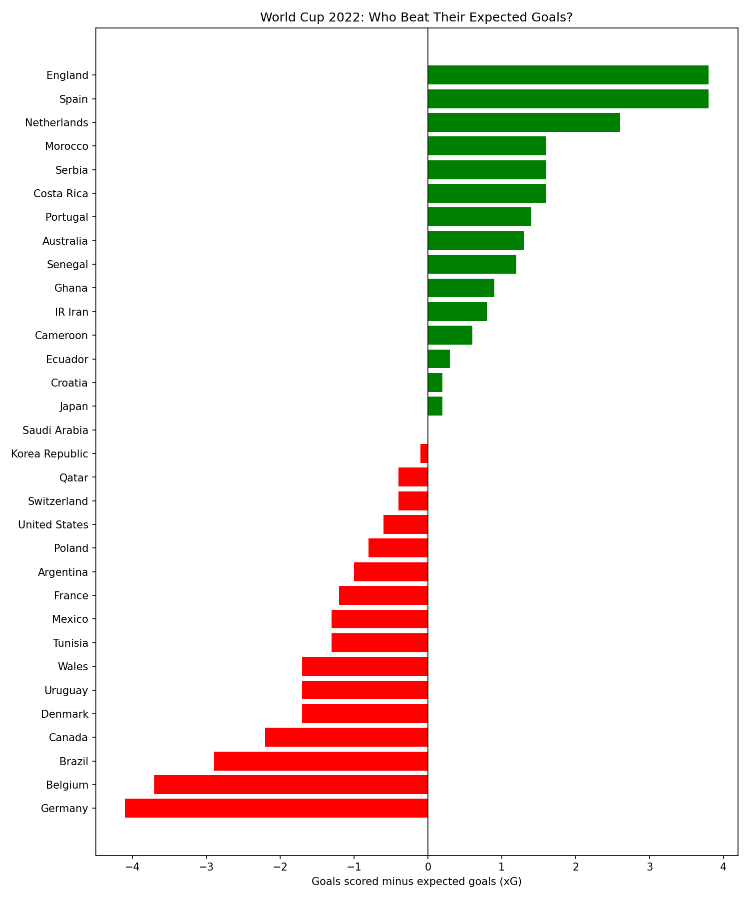

# World Cup 2022 — Expected Goals Analysis + Prediction

Looking at World Cup 2022 group stage data to find which teams over/underperformed
their expected goals (xG), then building a model to predict who advanced.

## Part 1: Analysis

xG measures the quality of chances a team creates. Comparing actual goals to
expected goals shows who finished well and who wasted chances — stuff the standings
don't really show.

Data: 2022 World Cup group stage stats for all 32 teams (from Kaggle). I made an
`overperformance` column (goals scored − xG) and charted it.

What stood out:
- England and Spain overperformed the most (+3.8 each).
- Germany created the most chances of anyone (10.1 xG) but only scored 6, and went
  out in the group stage. Finishing was the problem, not the play.
- Argentina actually underperformed their xG (−1.0) and still won the whole thing.

## Part 2: Predicting Who Advances

I trained a model to guess whether a team advanced (top 2 in their group) from their
stats.

- Target: advanced or not (based on group rank).
- Features: goals for/against, xG for/against, wins, draws, losses.
- Left out rank, points, and goal difference — they basically give away the answer
  (leakage).
- Used a decision tree with an 80/20 train/test split, so it's tested on teams it
  never saw.

Results:
- About 57% accuracy. It mostly missed by under-predicting — guessing teams wouldn't
  advance when they did. Probably because the dataset is small (32 teams).
- Feature importance: the model basically only used `wins`. One question ("did they
  win enough?") got the same accuracy as the full model. Makes sense — advancing is
  about points, and points come from wins.
- I also tried using only the xG features (no wins). Same 57%, but it flipped to
  over-predicting — guessing almost everyone advanced. Teams can play well and still
  go home (see Germany).

So advancing isn't really about play quality or results on their own. Also learned
that two models can have the same accuracy but be wrong in totally different ways.

## How to run
1. `pip install pandas matplotlib scikit-learn`
2. `python football_stats.py`
3. Prints the analysis + model results, saves the chart as `xg_chart.png`.

Built with Python, pandas, matplotlib, scikit-learn.